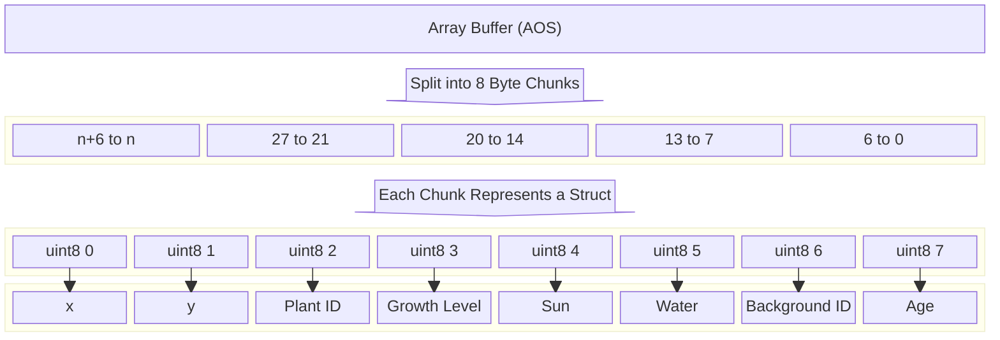

# Devlog - 11/17

## Introducing the Team

- Tools Lead: **Jack O’Brien**
- Engine Lead: **Luke Murayama**
- Design Lead: **Isha Chury**
- Co-design Lead: **Tony Pau**

#### Subroles

- Audio Design: **Vinh Ta**
- Video of Project: **Jack O’Brien**

## Tools and Materials

#### Game platform: p5

### Game engines/frameworks looked at

We plan on utilizing and launching on p5.js because it is a browser-based
framework that can be used to create and upload JavaScript projects on a web
browser. Because it works this way, it has the benefit of being system friendly
for programmers, unlike Unity or Unreal which takes a lot of space and power to
run and create with. We think meets with our design and style goals, while also
satisfying our technical goals.

### Programming languages going to be used

#### JavaScript/TypeScript and JSON

We’re planning to use TypeScript for our project because the team is used to
working with the language from this class and it’s fresh in everybody’s mind.
Everyone also has previous experience working with JavaScript, p5, and Phaser,
so we don’t have to learn a new game framework from scratch. TypeScript also has
other benefits, with the most useful feature being that it is a strongly typed
language. JSON would be used because of its compatibility with
JavaScript/TypeScript.

### Expected tools to use

- **Ableton** - for audio production. It is the digital audio workstation the
  audio designer is most familiar with.
- **Photoshop and other Adobe programs**
- **Deno** - A capable package manager for JavaScript and TypeScript.
- **VS Code** - We’re using VS Code over other code editors for its
  customizability and simplicity. It’ll let us add our own auto formatting and
  code checking. It is also very familiar to the dev team.
- **GitHub** - The most popular choice for source control and collaboration.
  We’ll be using this to keep our code updated between members.
- **Google Workspace** - for documentation. This suite of tools is good for
  making documents and slide decks for design and brainstorming. Highly
  accessible for the dev team, because it doesn’t require any downloads or
  payments. We won’t be needing any fancy tools for documentation or paper
  prototyping.

### Alternate platform choices

We're planning on switching to Phaser just so that when we do have to switch
frameworks, it'll be easier and the game will hopefully be better as a result.
We’re looking at Phaser for its familiarity amongst the dev team, as well as its
capability in creating 2D games for web browsers. It's framework we have all
made games with before in the past. This will allow us to hit the ground running
once we have to switch and get the game complete and polished as soon as
possible.

## Outlook

### What do we hope to accomplish

We hope to create a functional game that incorporates all of the assignment
requirements, while also allowing the player to have fun. Alongside this, we
would also like to include this game on our individual portfolios, and showcase
our individual efforts and work.

- We hope to make a game that exists
- Something fun
- Something to add to our individual portfolios

### What is the hardest/riskiest part of this

The hardest part of this project would be managing various tasks and
responsibilities across team members. It can be difficult to coordinate times to
host team meetings, as well as ensuring everyone contributes equally to the
project. Another challenge would be to handle the random requirement, and change
the project to suit it. In that same vein, it might be difficult to handle tasks
that may be too difficult given our current skill level and develop them within
the assignment’s deadline.

- Working and coordinating with a team.
- Finishing the project requirements on time.
- Dealing with the random requirements.
- Taking on bits that might be too difficult for current skill level within
  deadline.

### What are we hoping to learn from this

We aim to develop our ability to collaborate effectively, both in real-time and
asynchronously, while making meaningful contributions to the game's codebase. We
aim to follow best practices by writing clean, maintainable code, focusing on
implementing coding patterns and ensuring modularity throughout our project. We
hope to learn version control more efficiently and commit on a regular basis,
and follow best practices including formatting our code and refactoring.

- How to work on a game simultaneously and asynchronously so that we can work on
  our own and not have any bottlenecks.
- How to format a game to be extendable and modular within its code
- Version control and committing practices
- Code formatting and refactoring practices

# Devlog 11/27 - F0 Reflection

## How we satisfied the software requirements:

### [F0.a]

The game takes place on a predefined grid. The player can move from one grid
cell to any bordering grid cell not including diagonals. The player's movement
is fixed to the grid. The player movement is controlled via the WASD keys.

### [F0.b]

The game starts on turn zero. There is a button that allows the player to move
one turn forward. Moving forward a turn updates all the plants on the grid based
on predefined rules. This is the only way for plants to progress to the next
growth stage.

### [F0.c]

When the player moves their mouse around the grid, the grid that their mouse is
on is highlighted. If the mouse is too far from the player, it will highlight
red and only show the tile information. If the mouse is close to the player, it
will be highlighted green and allow the player to plant or harvest in that cell.

### [F0.d]

Each grid location has an associated interface. The interface contains
information of the following: plantID, growth, sun, water, backgroundID, and
age. Every turn, the sun value is set to a random value and the water value is
incremented by a random amount. Plants use up water while they grow.

### [F0.e]

There are currently six different types of plants and each plant has three
distinct growth phases.
[Hana Caraka - Farming Crops Pack](https://bagong-games.itch.io/hana-caraka-crops-pack)
is the source for the images. The important information for each plant is stored
in a separate plants.ts file.

### [F0.f]

There are simple spatial rules that govern plant growth based on the following
factors: sun energy, water accumulation, and nearby plants of the same species.
Each plant has a different growth rate, maturing at different times. Plants
progress through four growth stages: initial planting, sprouting, budding, and
full maturity. If two plants of the same species are near one another, they
receive a significant boost. However, if three or more plants of the same
species are planted next to each other, they will have competition for
resources, decreasing their time to grow. If seeds are planted in slots with
five or more solar energy points, they receive an initial ten percent growth
boost. Similarly, if seeds are planted in slots with five or more water points,
plants receive a five percent boost.

### [F0.g]

The win condition for this level is relatively simple, consisting of the player
collecting 12 or more plants of any variety. This was implemented by creating a
dictionary to hold information about the plants harvested. Once the plants
matured and the player clicked on them, the location slot would revert back to
its original state. Before this occurs, information about the species of plant
and the number of plants collected is added to a dictionary. This dictionary is
later referenced, and if its length is greater than or equal to 12, the win text
appears. This indicates that the player has won the level.

## Reflection:

Jack O’Brien - I think what we got done had fulfilled the requirements we needed
for this. The functionality was well defined and everything seemed to work as
intended. Even though more polish could have been added to the visual side,
everything seems conveyed in an understandable way. I do think we could have
talked more about the game as a team and had more meetings throughout the work.
Luke ended up making a lot of the base of the game before most of the discussion
had happened. By doing this, we could have separated the work out more instead
of having most of the foundation done by one person. As a member, I would have
liked to contribute more as most of what I did was the win condition and fixing
a bug with the growth level which was a problem. Most of this is due to me
working on D3 as well as other projects I had in other classes.

Vinh - We definitely could have used a production lead of some sort. Luke laid
the foundation of F0 and the rest of the game down, but we had never discussed
the themes or details of the game past a few general ideas. F0 was halfway done
before we would talk about the game again as a team. Maybe as a result, we
decided to move forward with a different language and alternate platform; but I
think that’s just the necessity of descoping, as with most class projects.
_We’re all busy and stressed out, I don’t blame us for how things started._ With
that being said, I don’t know if we’d instate a production lead formally. We’re
all on the same page now, and we talk more now. I’m glad about that. I’ve been
working ahead on F1, but I do wish I was able to help more with F0. Regardless,
everyone’s picking up our game pretty quick. _I’m proud of the team for our
ability to work together, and especially appreciative of Luke for getting our
momentum going._ I hope I can do more going forward.

Tony Pau - For F0 we have completed all the requirements and all within a week
too. The big issue was the time spent on F0 was definitely short and could be
started at an earlier date. Everything was done within a week after the initial
due date. We’ve tried to do group meets and tried to plan everything out but a
chaotic week and other factors made it very difficult. I do wish I played a
bigger role for F0 since the workload was very unbalanced and although we did
call which part we would do, it wasn’t too well planned and could’ve used more
group decision to decide a fair even work load. I’m definitely gonna do more for
future parts of this project but for F0 specifically I felt pretty useless as we
all were busy and all the parts of F0 were pretty much done.

Isha Chury - I think that fulfilled all of the requirements necessary for
completing the F0 assignment. However, I do think that as a group we could have
assigned tasks earlier, and split the workload more evenly. While we did have
some team meetings, we weren’t initially certain of the requirements and instead
focused on other things including assigning team roles and setting up our
workflows. Luke wrote a large amount of code for the F0 assignment, establishing
the base of our game and its functionality. While the majority of F0 had been
set-up, other team members helped refine the code and add some of the pending
requirements. I helped in implementing the growth and spatial rules for plants,
as well as refactoring the code for the win condition. I feel that if I had
started earlier I could have helped contribute more towards the code. However,
because of this, we as a team are talking more about splitting roles and
workload more evenly. I think that going forwards, we will be more careful in
making sure that no one person has too much of a workload.

Luke Murayama - We had a couple early meetings where we discussed roles and even
met up in person to discuss what we were going to do. I first worked on getting
p5js to work with Deno and Vite, then I mainly focused on getting it
encapsulated so the renderer would be easy to swap. I jumped the gun a bit since
I had the free time and began just trying to implement basic features, but I
regret not consulting the team first before going ahead, it wasn’t really fair.
We had multiple meetings since then and other team members have helped to flesh
out the game and actually make it playable. We did end up reducing the scope of
the game from some of our more ambitious ideas.

# Devlog 12/4 - F1 Reflection

## How we satisfied the software requirements:

### [F1.a]
The grid state is stored as an array buffer containing an array of structs. Each tile on the grid is represented as a series of 8 Uint8s in the grid array. Each one of the Uint8s represents a piece of information, from the location of the tile, the water level, or what plant is growing there.

### [F1.b]
The save/load function is implemented in two parts. The grid class we have implemented is able to serialize its state into a string. This string is a representation of the Uint8 series that our grid is stored as. This string can also be deserialized back into an array of Uint8, so that we may restore the save state. This is our two primary save/load helper methods. Then, our main file can use these helper methods to save the game into a JSON and load the game from a JSON, by creating or reading said file and setting the grid state to match.

### [F1.c]
Autosaving is pretty straightforward. Anytime the “beforeunload” event is sent, i.e. refreshing or closing the page, it will save into a localstorage with a key called “autosave.” This can then be loaded the same way saves are loaded, so that players can come back right before they quit the game.

### [F1.d] 
To create the undo and redo functionality, the entire grid array was cloned and added to the undo stack. This stack would capture the array every time the user made a change to it, including information about the plant’s growth level, water levels, and sun energy levels. This was specifically handled through the saveStatetoUndoStack function. This function is called every time the player presses the turn button, updating the game state. The undo function adds the most recent state of the grid (prior to the change) to the redo stack, and calls the pop function. This makes it so that the previous version of the grid state can be accessed, and through the use of the refreshDisplay function, can be visually shown on the plant’s tile. The reo function follows similar logic, in which the redo stack pushes the current state to the undo stack, and later calls on the pop function. This allows it to revert back to the player’s original state. 

### How does the user interface provides feedback to players on their available choices and the impacts of their choices
Parts of the game's UI are built using HTML elements. HTML buttons, while not the most aesthetic, easily convey interactivity with their shape and how they react to mouse events. The UI that’s part of the game view is mainly shown through a highlight that will display on whichever tile the mouse is hovering over. A green highlight indicates that the tile is in range and a red tile is out of range.

When the player clicks on a tile, the impact is immediate as it shows seeds placed on the tile. There is also a tile information section placed below the game view which tells the player information about the tile. As the player presses the turn button over a period of time, the plants visually show growth, going from being represented as a seedling to a fully mature plant. 

## How we satisfied the software requirements

## Reflection

Jack O’Brien - We were working on both the F0 and F1 portions of this simultaneously.  I did not get to add much to this portion mostly due to conflicts in other assignments I had, but the progress this team was able to make is impressive to say the least.  However, we did have a similar problem to the last assignment where we did not talk much through meetings as a team to go over some of this ahead of time.  A lot of the work still fell on Luke, but the work was at least spread out more as we went on with this part of the project.  This was a better effort, but I know we can and will do better in the future.

Luke Murayama - I created the base for the grid and the underlying array buffer. I chose to use only uint8s not for space efficiency but because it made the implementation much more simple. It also made it easier for the buffer to be modified by others, which it was. Changes weren’t really made based on any player feedback, but by the design sense of all the people working on the games. We’ve been somewhat behind schedule so have not considered any drastic changes after the initial base was complete.

Vinh Ta - For F1, I assigned myself the task of implementing saves. It sounded so easy on paper, but I time and time again ran into errors that I couldn’t begin to comprehend. I think one thing I’d like to do moving forward is to utilize Brace more often. I spent too much time scrambling through documentation and StackOverflow and not enough time identifying and fixing problems. I’d like to mention how grateful I am for this team. A lot of my learning has come through and from them.

Isha Chury - For the F1 assignment, I worked on the undo and redo functionality. I felt that Luke had set up the base for the code very well, so it was relatively easy to add on. The undo and redo functions were relatively straightforward, though I did run into a few bugs. This was primarily because the grid array did not save the day counter, so it created a mismatch between the current day within the game (as counted by the player) and what was displayed on the screen. Other than that, I did not run into any major errors, and was able to add my part of the assignment relatively quickly. I did feel that we were behind schedule due to Thanksgiving break, but I hope we can pick up our pace soon and get things done. 

Tony Pau - For F1 I didn’t work on much. I assigned myself to F2 and worked on designing an external scenario for the game. I also had many big assignments for this class and other classes that I was needing to finish, from writing reports to designing assets for games. Although I haven’t got to work on F1 personally, the team made impressive progress on the assignment in such a short time. I think we did better compared to F0 as we had assigned roles for specific tasks, but the same issue popped up where we had an issue meeting up. I think we made a huge improvement from F1 and I think we can take from this for work on future installations of this project. As chaotic this assignment was, I think the team did amazing and Thanksgiving break was much needed to slow everything down as everyone has been overwhelmed with many assignments with close deadlines.

# Devlog 12/6 - F2 Reflection

## How we satisfied the software requirements

### F0+F1
Growth conditions were changed because of the requirements on this video.

### F2a External DSL for Scenario Design
This part is approached by storing the scenario using a YAML file format. On the scenario, we listed everything into one big string which is parsed into JS and contains information on the weather and win condition. The scenario.ts file will read the string file and export it onto our main file in order to create custom weather that affects the sun and water levels of the tiles on specific days and also gets the win condition.

### F2b Internal DSL for Plants and Growth Conditions
For this we made a separate interface that contained a growth function which took in a grid and the x and y of the cell.  This then checks certain conditions based on the plant which vary from some caring about sun and water levels more to caring about neighbors and who is neighboring each other.  This then returns the number value used to multiply with for the growth rate that is used each iteration of growth for the plant.

### F2c Switch to Alternate Platform
We switched from using the canvas provided by P5js to just using the basic javascript canvas. This was fairly simple and required barely any changes to the main code since a renderer class was created to completely encapsulate the P5js code. The renderers both provided two functions, one that adds an image to the canvas and one that clears the canvas. The canvases can be switched while the game is running.

## Reflection

Jack O’Brien - I worked on F2b in its entirety. For this, I made rules for each plant to give it something unique itself. Some depend on certain sun and water values, while others depend more on neighbors. To accomplish this, I created an interface featuring a function called growthCondition which takes in a grid and position(x,y) then returns a number used as the growth multiplier for the plant based on the conditionals within that said plant.  This all replaced the original logic and makes it unique amongst each plant. I was also working on the video for the F0 whilst doing this assignment which made things difficult since I had to use an older version on that video instead. The amount of in-person meetings we had helped with me figuring out what to do for this as my teammates were there to help when I was having trouble.

Luke Murayama - I worked on creating the original P5js renderer so for F2 I worked on switching over to the default JS canvas. We also had multiple team meetings that assigned different requirements to different people. I think that the initial lead roles kinda fell away at this point. Nonetheless, I think everybody worked hard for this portion of the project. 

Vinh Ta - I didn’t do much for F2. While the team was working on F2, I think I just moved ahead to F3 and tried to help complete some of those software requirements. I did work on adding some juice to the game. I made some music for the game and implemented it in a way so it played once the player harvested a plant. The code is extremely messy and all in main. I’d like to learn how to encapsulate it into its own file, like the others did with their code for things like plants, grids, localization, etc. As it is currently, it’s all over the place. It still works nonetheless, and I hope it makes our game stand out a bit.

Isha Chury - For the F2 assignment, I was not able to contribute as much. I mainly assigned myself to the F3a and F3b requirements, but I did try to help others understand how I implemented the plant growth rates and various boosts. Though I didn’t explicitly work on the F2 assignment, I did use the time to start implementing my parts for the F3 assignment. Compared to F0 and F1, I felt that though we were a little behind, we did get things in and communicated more about our progress. Though not all of us were able to make in-person meetings, we did reach out regarding our roles and committed to the repository. I think the team did an amazing job putting together this project, and refining it. 

Tony Pau - For F2, I have focused on doing F2.A. I started with a pretty complicated design for my first attempt then redid it using Yaml. I never used Yaml and github stuff in general is quite confusing to me so I had a lot of issues from needing to run —no verify in terminal to commit to learning different methods for reading and writing files. This assignment really made me lose it as I spent days on it and got basically nowhere but eventually everything was in theory working. Stuff was broken but the vision was there but once again I had to scrap the approach and restart and was stuck again. It was a very frustrating cycle but eventually I got a break. Compared to F0 and F1, F2 was a big step up and I think is where everyone knew what parts they were working on, deadlines, and meeting times. We definitely were on top of our game for F2 and the team did amazing.
